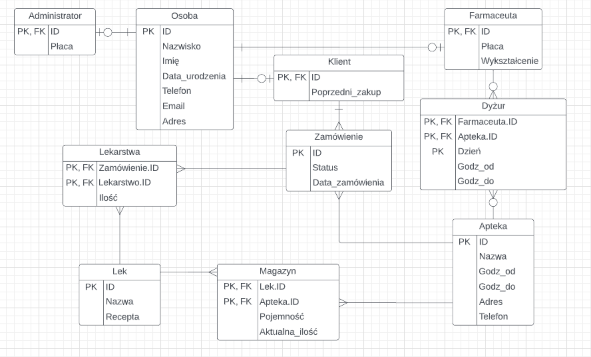

# Pharmacy Management System

## Description

This web application helps to manage a network of pharmacies.
A user can perform basic operations on data:

1. View
2. Search
3. Add
4. Modify
5. Delete

It has a division into roles (Administrator and pharmacist), where each has its own set of functions. 
For example, an administrator can add a new pharmacy to our database, can change the salary of a pharmacist, and much more. 
The pharmacist, in turn, can prescribe medicines for the client, can check the availability of medicines in stock and much more.
This application is built using Python/Flask/Mysql/Xampp/Html/Css

In general, it has everything you need for a good job as a pharmacy chain manager!

## How to build

To build the project, follow these steps:

1. At the very beginning, you need to download the project from the repository
2. Make sure you have a virtual environment installed on your machine. If you do not have it installed, then please follow the following instructions on this page (https://docs.python.org/3/library/venv.html)
3. After that, you need to run the virtual environment in project directory and install flask with the following command

```
pip install flask
```

4. Make sure that you have mysql installed and also downloaded XAMPP, which can be installed from the page (https://www.apachefriends.org/download.html)
5. Then you need to run the MySQL server in the XAMPP application
6. Now you can run the project with the following command

```
python3 app.py
```

This command will run the main code and in the response you will receive a link to our web application, which can be opened in any browser!

## Program structure

The application is structured as follows:




